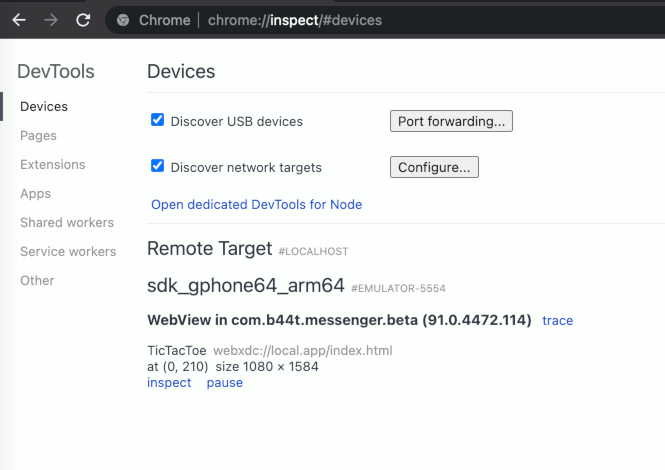
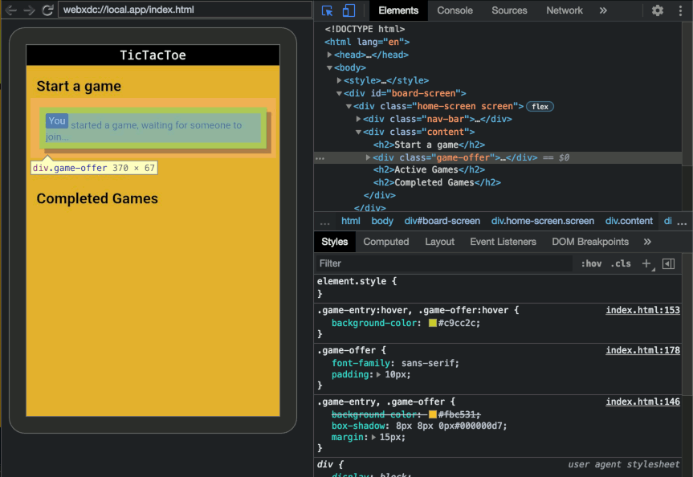
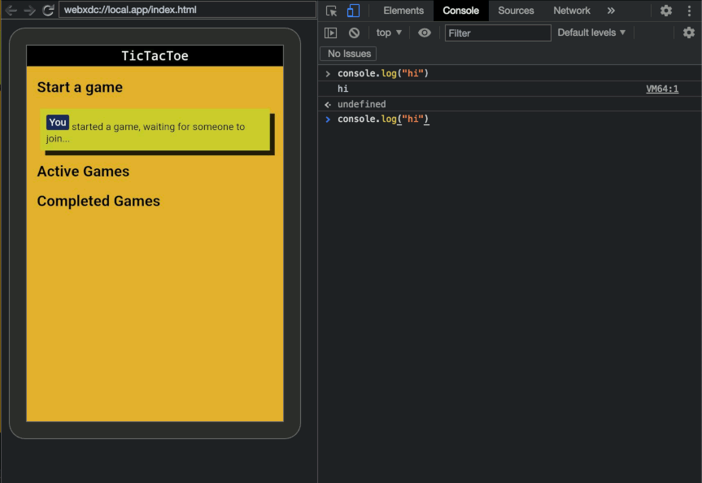

# Debugging inside Deltachat

## Debug your webxdc app in Android via Chrome DevTools

1. enable webView debugging in delta chat settings `Settings` > `Advanced` > `Developer Mode`: 
1. enable developer mode and ADB debugging on your device *(go to system settings, device info, spam click on build number until there is a toast telling you that you are now a "Developer", then go into the developer menu that just appeared and enable "ADB debugging", see also [android docs: Enable ADB debugging on your device](https://developer.android.com/studio/command-line/adb#Enabling)).*
1. connect your device via USB to your computer
1. open chromium (or google chrome) and go to `chrome://inspect/#devices`
1. open your webxdc app that you want to debug
1. click on `inspect`:

| Inpect HTML                                                      | Javascript Console                                               |
| ---------------------------------------------------------------- | ---------------------------------------------------------------- |
|  |  |

> Make sure to **disable adb debugging again** after you are done with debugging!

## Debug your webxdc app in DeltaChat desktop

TODO, waiting for desktop implementation
