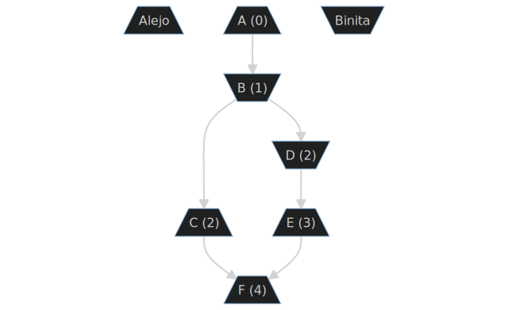

# Conflicts

This section will describe several important factors to consider when developing webxdc applications that must synchronize application state across multiple devices.
It will provide a basic example of how this is typically accomplished in the conventional [client-server model](https://en.wikipedia.org/wiki/Client%E2%80%93server_model),
and compare this methodology against those commonly employed in federated or [peer-to-peer](https://en.wikipedia.org/wiki/Peer-to-peer) (**P2P**) contexts.

## Resolution in the Client-Server model

An example which should be familiar to most is that of a multi-user chat room with the ability to broadcast messages and update the room's description.
The more populated and active the room is, the greater the likelihood that two of its members attempt to update its description at the same time.
How could that be resolved?

Suppose the two active users are named _Alice_ and _Bob_,
that they discussed updating the description without specifying who should update it,
that each sent a slight variation of the same text to the server,
and that the server relays messages in the order they were received.

1. Alice and Bob send their updates
2. The server receives one of their messages first, suppose it is Alice's
    1. The server updates its database to set the room's current description to Alice's text
    2. It then queues an acknowledgement to Alice so she knows that her message was received
    3. Next it queues a message to every other participant in the room informing them of Alice's update
3. The server then receives Bob's message and repeats the same steps
4. All of the room's participants receive both changes to the description, first Alice's, then Bob's

There are a few reasons why this works so well:

* in practice one of the two messages will always arrive first
* even if messages arrive at exactly the same time, the server can put them into an arbitrary order using a variety of strategies (commonly _last-write wins_) because it has complete authority over this resolution
* the set of all operations can therefore be said to have a [total order](https://en.wikipedia.org/wiki/Total_order) from the server's perspective
* the server's ordering is relayed to every participant, making it trivial for everyone to apply updates in the same order, and thus agree on the new state, achieving a quality known as _global consistency_

## The federated model

Before the widespread consolidation of email and messaging servers by mega-corporations
it was common for organizations like businesses, educational institutes, and governmental departments
to run their own email servers.
Historically, these systems originated as a means for individuals within these organizations to message their colleagues.

**Federated protocols** define how servers each belonging to a single organization can exchange messages between each other,
allowing members of one service to deliver messages to those on another.
This model is highly resilient.
While one or several servers may experience performance issues or downtime, it is rare or unheard of for the entire network to cease operation.

This model is so successful that it has been adopted by many successive generations of messaging technologies beyond email, such as [NNTP](https://en.wikipedia.org/wiki/Network_News_Transfer_Protocol) (Usenet), certain [Bulletin Board Systems](https://en.wikipedia.org/wiki/Bulletin_board_system), [IRC](https://en.wikipedia.org/wiki/Internet_Relay_Chat), [XMPP](hTTPS://en.wikipedia.org/wiki/XMPP), [Matrix](https://en.wikipedia.org/wiki/Matrix_(protocol)), and various custom social media protocols that were eventually consolidated into [ActivityPub](https://en.wikipedia.org/wiki/ActivityPub).

## Complications in federation

While there are many benefits of this architecture, the presence of an additional server has two consequences:

1. concurrent messages may arrive at multiple destinations in different orders
2. servers can no longer apply messages in arbitrary order without the risk of conflict

In the previous model the ordering of messages was entirely determined from the perspective of a single server, so it was sufficient to only measure the time at which participants' messages were received and ignore many other practical considerations of message delivery.
In reality, messages do not arrive immediately, but take time to reach their destination.
Furthermore, participants in the system will likely have different upload and download speeds, or otherwise have variable latency between any potential recipient of their messages.

If we update our model to account for additional servers with differing amounts of latency between them, then it can be seen that consistent ordering of events is no longer guaranteed.

In a more complex scenario, _Alejo_ and _Binita_ have joined a chat room via two different servers (_argentina.chat.website_) and (_bangladesh.chat.website_).
Once again, they both want to update a room's description, but there is a considerable delay between the two servers which collaboratively host the room's members.

1. Alejo and Binita concurrently update a room's description by sending a message to their respective servers
2. Their servers send messages acknowledging that they have received and applied their updates
3. The servers relay these messages to remote servers which host room members
    * _argentina.chat.website_ attempts to inform _bangladesh.chat.website_ of Alejo's update
    * _bangladesh.chat.website_ attempts to inform _argentina.chat.website_ of Binita's update
4. The servers receive each other's updates and relay them to their respective members
5. Alejo and Binita receive each other's description updates after their own updates were acknowledged, and so believe that their own update was overridden

It is possible for a federated system's state to become inconsistent even in relatively simple circumstances such as this, where there are only two servers with one member each.
This particular type of bug is called a [race condition](https://en.wikipedia.org/wiki/Race_condition), and they become increasingly likely as a system has more participants, more activity, or greater latency between servers.
There are a variety of techniques to prevent, detect, or recover from such inconsistencies, but special care must be taken to implement them.

## Conflict resolution in webxdc applications

The webxdc specification describes methods for broadcasting arbitrary messages to a group ([`webxdc.sendUpdate()`](../spec/sendUpdate.html#sendupdate))
and for receiving other members messages ([`webxdc.setUpdateListener()`](/spec/setUpdateListener.html#setupdatelistener)),
but it is unopinionated about how those messages should be interpreted
for the purposes of maintaining persistent updates to an application's internal state.
This leaves webxdc application developers free to choose whichever strategy they deem appropriate,
but with this freedom comes a responsibility to address any potential bugs that might arise
as a result of the underlying transport mechanism's [asynchronous](https://developer.mozilla.org/en-US/docs/Glossary/Asynchronous) nature.

Depending on the intended purpose of your application it is entirely possible that such concerns will not affect those who use it.
For example, apps that perform simple functions like converting inputs between units or formats most likely have no need
for any persistent state or interaction with other users.
Such apps can be packaged and distributed in the webxdc format without any need of its networking capabilities.

Even if an app does communicate through the provided APIs, it might do so in a way that cannot produce inconsistencies.
The example of updating a chat room's description was only problematic because more than one person could change it concurrently.
Such an app could avoid this problem entirely by allowing each user to set their own personal status rather than allowing updates to a shared value.
It is worth noting that issues can occur even when a value is scoped to a particular user if the application hosting the webxdc app allows for a single user to participate with more than one device.
It is ultimately up to an app's developers whether they want to support such use-cases.

## Partial ordering

In the example above, Alejo and Binita can not eliminate the possibility of messages being sent at the same time, and thus cannot guarantee that all messages will have a consistent ordering.
Even so, it is possible for at least some of these messages to have a consistent ordering.
When this is achieved, the collection of all their messages can be said to be [**partially ordered**](https://en.wikipedia.org/wiki/Partially_ordered_set).

There are a number of techniques through which this can be accomplished, generally using either a [logical clock](https://en.wikipedia.org/wiki/Logical_clock) (commonly using [Lamport timestamps](https://en.wikipedia.org/wiki/Lamport_timestamp)) or by structuring messages in a [directed acyclic graph](https://en.wikipedia.org/wiki/Directed_acyclic_graph) using references to the immediately preceding messages.

Computers can have inaccurate physical clocks, so relying on them to order messages can be problematic, potentially resulting in messages that appear to come from the impossibly distant past or future.
Instead, these more advanced techniques depend on nothing but the system itself to detect when two messages were sent and received in the correct sequence.

Lamport timestamps, for example, set the counter of the current message to one more than the previously greatest timestamp.
If Alice and Bob both tried to repeatedly set the description for a group, it might play out like so:

1. Alejo sets the description using a message (A) with an id `0`
2. Binita receives this message, but wants to correct a typo, so she sends an update (B) with id `1`. Alejo can determine that this was sent and received in the right order, so this should supercede his own description rather than be treated as a conflict
3. They both decide to add some emojis to the description, and do so in parallel (messages C and D), but with different emojis. Each believes their message to correctly have the id `2`
4. Before either of the previous messages have been delivered, Binita sends one more update (E) to add another emoji using id `3`
5. Alejo and Binita receive each others' messages:
    * because C and D both have id `2`, Binita can conclude that Alejo was not aware of her message when he authored his
    * Alejo can conclude the same of Binita's D, but cannot determine whether she was aware of his C when she sent E. Because of this uncertainty, they should both treat these messages as having been authored concurrently, resulting in a conflict
6. Alejo decides to resolve this conflict, authoring a new description which includes the corrected typo and all emojis added by either of them. When Binita receives it will have clearly been sent after both C and E

This method is popular both for its relative simplicity and the small amount of overhead that is introduced by including a counter in each message.
It is somewhat ambiguous about exactly which messages have been received, however, it remains very effective in systems that require a high number of messages with minimal overhead.
For these reasons, it is used by [Yjs](https://yjs.dev/), which will be discussed later in this chapter.

Another popular approach which is more explicit but less compact involves the use of [cryptographic hash functions](https://en.wikipedia.org/wiki/Cryptographic_hash_function).
Instead of a single counter, a list of hashes of the preceding messages which were known at the time the message was authored.
This makes it possible to detect when a message has not been delivered or if message history has somehow been altered (although the latter probably isn't a concern with webxdc apps).
Variations of this technique are applied in [Git](https://git-scm.com/), [BitTorrent](https://en.wikipedia.org/wiki/BitTorrent),
[Matrix](https://en.wikipedia.org/wiki/Matrix_(protocol)), [Secure Scuttlebutt](https://en.wikipedia.org/wiki/Secure_Scuttlebutt),
[IPFS](https://en.wikipedia.org/wiki/InterPlanetary_File_System), and many other protocols intended to solve a variety of problems.

Either of these general techniques convey a notion of _causality_.
Techniques to resolve conflicts can be computationally expensive, or can require manual human intervention.
Tracking causality and ruling out conflicts are an effective first line of defense in systems like webxdc apps where messages are not guaranteed to be ordered.

With the knowledge of how conflicts can occur in distributed systems,
and some basic techniques to reduce their frequency,
we can now move on and introduce a technology designed to eliminate them entirely.

