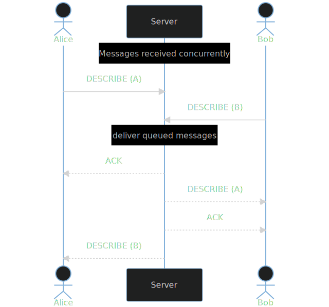
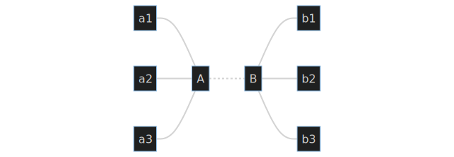
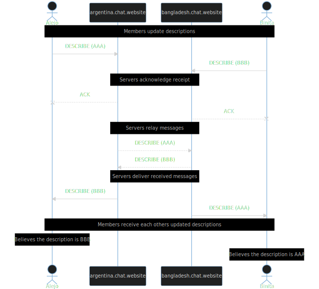

# Conflicts

This section will describe several important factors to consider when developing webxdc applications that must synchronize application state across multiple devices.
It will provide a basic example of how this is typically accomplished in the conventional [client-server model](https://en.wikipedia.org/wiki/Client%E2%80%93server_model),
and compare this methodology against those commonly employed in federated or [peer-to-peer](https://en.wikipedia.org/wiki/Peer-to-peer) (**P2P**) contexts.

## Resolution in the Client-Server model

An example which should be familiar to most is that of a multi-user chat room with the ability to broadcast messages and update the room's description.
The more populated and active the room is, the greater the likelihood that two of its members attempt to update some of its description at the same time.
How could that be resolved?

Suppose the two active users are named _Alice_ and _Bob_,
that they discussed updating the description without specifying who should update it,
and that each sent a slight variation of the same text to the server,
and that the server relays messages in the order they were received.

1. Alice and Bob send their updates
2. The server receives one of their messages first, suppose it is Alice's
    1. The server updates its database to set the room's current description to Alice's text
    2. It then queues an acknowledgement to Alice so she knows that her message was received
    3. Next it queues a message to every other participant in the room informing them of Alice's update
3. The server then receives Bob's message and repeats the same steps
4. All of the room's participants receive both changes to the description, first Alice's, then Bob's

* in practice one of the two messages will always arrive first
* even if they arrived at exactly the same time the server can put them into an arbitrary order using a variety of strategies (commonly _last-write wins_)
* this works because the server has complete authority over resolution
* the set of all operations can be said to have a [total order](https://en.wikipedia.org/wiki/Total_order)
* when every participant in the system agrees on the ordering of messages, it is said to be _globally consistent_

## The federated model

Before the widespread consolidation of email and messaging servers by mega-corporations
it was common for organizations like businesses, educational institutes, and governmental departments
to run their own email servers.
Historically, these systems originated as a means for individuals within these organizations to message their colleagues.

**Federated protocols** define how servers belonging to a single organization can exchange messages between each other,
allowing members of one service to deliver messages to those on another.
This model is highly resilient.
While one or several servers may experience performance issues or downtime, it is rare or unheard of for the entire network to cease operation.

This model is so successful that it has been adopted by many successive generations of messaging technologies, such as [NNTP](https://en.wikipedia.org/wiki/Network_News_Transfer_Protocol) (Usenet), certain [Bulletin Board Systems](https://en.wikipedia.org/wiki/Bulletin_board_system), [IRC](https://en.wikipedia.org/wiki/Internet_Relay_Chat), [XMPP](hTTPS://en.wikipedia.org/wiki/XMPP), [Matrix](https://en.wikipedia.org/wiki/Matrix_(protocol)), and various custom social media protocols that were eventually consolidated into [ActivityPub](https://en.wikipedia.org/wiki/ActivityPub).

## Complications in federation

While there are many benefits of this architecture, the presence of an additional server has two consequences:

1. concurrent messages may arrive at multiple destinations in different orders
2. servers can no longer apply messages in arbitrary order without the risk of conflict

In the previous model the ordering of messages was entirely determined from the perspective of the single server, so it was sufficient to only measure the time at which participants' messages were received.
In reality, there are more factors to consider.
Messages do not arrive immediately, but take time to reach their destination.
Furthermore, participants in the system will likely have different upload and download speeds, or otherwise have variable latency between any potential recipient of their messages.

If we update our model to account additional servers with diverse then it can be seen that consistent ordering of events is no longer guaranteed.

This time Alejo and Binita have joined a chat room via two different servers (_argentina.chat.website_) and (_bangladesh.chat.website_).
Once again, they both want to update a room's description, but there is a considerable delay between their two servers.

1. Alejo and Binita concurrently update a room's description by sending a message to their respective servers
2. Their servers send messages acknowledging that they have received and applied their updates
3. The servers relay these messages to remote servers which host room members
    * _argentina.chat.website_ attempts to inform _bangladesh.chat.website_ of Alejo's update
    * _bangladesh.chat.website_ attempts to inform _argentina.chat.website_ of Binita's update
4. The servers receive each other's updates and relay them to their respective members
5. Alejo and Binita receive each other's description updates after their own updates were acknowledged, and so believe that their own update was overridden

It is possible for a federated system's state to become inconsistent even in relatively simple circumstances such as this, where there are only two servers with one member each.
This particular type oof bug is called a [race condition](https://en.wikipedia.org/wiki/Race_condition), and they become increasingly likely as a system has more participants, more activity, or greater latency between servers.
There are a variety of techniques to prevent, detect, or recover from such inconsistencies, but special care must be taken to implement them.

## Resolution in webxdc applications

The webxdc specification describes methods for broadcasting arbitrary messages to a group,
and for receiving other members messages, but it is unopinionated about how those messages
should be interpreted for the purposes of maintaining persistent updates to an application's internal state.
This leaves webxdc application developers free to choose whichever strategy they deem appropriate,
but with this freedom comes a responsibility to address any potential bugs that might arise
as a result of the underlying transport mechanism's [asynchronous](https://developer.mozilla.org/en-US/docs/Glossary/Asynchronous) nature.

Depending on the intended purpose of your application it is entirely possible that such concerns will not affect those who use it.
For example, apps that perform simple functions like converting inputs between units or formats most likely have no need
for any persistent state or interaction with other users.
Such apps can be packaged and distributed in the webxdc format without any need of its networking capabilities.

Even if an app does communicate through the provided APIs, it might do so in a way that cannot produce inconsistencies.
The example of updating a chat room's description was only problematic because more than one person could change it concurrently.
Such an app could avoid this problem entirely by allowing each user to set their own personal status rather than allowing updates to a shared value.
It is worth noting that issues can occur even when a value is scoped to a particular user if the application hosting the webxdc app allows for a single user to participate with more than one device.
It is ultimately up to an app's developers whether they want to support such use-cases.

## Timestamping and its limitations

**Timestamping** is a simple method to ensure that all messages can be applied by all participants in a distributed system.
By including your device's current time in every application update it becomes possible for all peers to ensure that updates are applied in the correct order, and to recompute the correct state from retained copies of all known updates if a message is ever received out of order.

In very simple cases this approach can be sufficient, however, there are two main reasons why its use is generally discouraged:

1. system clocks are not guaranteed to be correct
2. participants in a system are not necessarily honest

In the first case, a clock that is set too early can cause all of a user's actions to be ignored by remote users who interpret their messages as already having been superceded by other events with more recent timestamps.
Alternatively, if one person's clock is set to some time in the future then their updates may override those of everyone else.
Such an application's state would be **consistent**, but it would be at the risk of it becoming non-functional in the event that a single inaccurate clock.

It can be tempting to address some of these concerns by ignoring messages with timestamps from the future.
Unfortunately, adopting such a policy can reintroduce the risk of inconsistencies for users with incorrect clocks, causing them to either view older states or allowing them to make changes that nobody else will replicate until they become valid.

## Cryptographic hashes for causal determinacy

[Cryptographic hash functions](https://en.wikipedia.org/wiki/Cryptographic_hash_function) make it possible to compute a value which can be used as a practically unforgeable fingerprint for any given input, commonly referred to as _that input's hash_.
They are very commonly used in systems as a way of checking integrity in systems that require consistency.

While other methods typically involve sending unqualified instructions to other peers:

> e.g. `update the group topic to "Pizza"`

...hash functions make it possible to specify the exact context to which the instruction relates

> e.g. `I believe the current state of the application hashes to "fb3859832d5f328338249617e98e6623e402eb1ccd0e44816df272e4691b67ca" and I would like to change the group topic to "Pizza"`

Because each update is delived along with a reference to the one preceding it, participants can assemble all updates into tree data structure which tracks which updates caused which outcomes.
Branches in that tree can be recognized as _concurrent updates_ far more reliably than in systems using the previous methods.
In cases where concurrent updates affect unrelated aspects of the application's state it is typically possible to automatically merge them using a predetermined _strategy_.

Variations of this technique are applied in [Git](https://git-scm.com/), [BitTorrent](https://en.wikipedia.org/wiki/BitTorrent),
[Matrix](https://en.wikipedia.org/wiki/Matrix_(protocol)), [Secure Scuttlebutt](https://en.wikipedia.org/wiki/Secure_Scuttlebutt),
[IPFS](https://en.wikipedia.org/wiki/InterPlanetary_File_System), and various other protocols intended to solve a variety of problems.
While it is generally worthwhile to have a basic understanding of the general concept,
practical systems built with this idea in mind can require sufficient complexity
that it is not worthwhile to reimplement it on a per-application basis.
Instead, the next section of this chapter will focus on the use of a particular application of this idea - [Conflict-free Replicated Data Types](https://en.wikipedia.org/wiki/Conflict-free_replicated_data_type) (**CRDTs**).

